# Pulse MPC — Secure Audio Delivery Architecture

> **Pulse MPC** is a browser-based Music Production Center built with React, TypeScript, Web Audio API, and a Node.js / Express secure audio streaming backend. This document details the **Threat Model**, **Security Architecture**, and **Technical Boundaries** governing audio sample delivery.

---

## 📐 System Architecture — Sequence Diagram

```mermaid
sequenceDiagram
    autonumber

    participant U  as 👤 User
    participant BR as 🌐 Browser<br/>(React + TypeScript)
    participant AA as 🔐 Authentication API<br/>(Express / JWT)
    participant SM as 🛡️ Security Middleware<br/>(Cookie · Origin · Rate Limit)
    participant SA as 🎵 Secure Audio API<br/>(Express Stream)
    participant MS as 📋 Manifest Service<br/>(UUID Resolver)
    participant SS as 💾 Sample Storage<br/>(Outside Web Root)
    participant WA as 🔊 Web Audio API<br/>(AudioContext)

    %% ─────────────────────────────────────────
    rect rgb(20, 30, 48)
        Note over U,WA: ── Phase 1 · Session Establishment ──────────────────────────────────
        U  ->>+ BR: Opens Pulse MPC
        BR ->>+ AA: POST /api/auth/login<br/>{ credentials: include }
        AA ->>  AA: Validate credentials<br/>Sign JWT (10 min access token)<br/>Sign Refresh Token (7 days)
        AA -->> BR: 200 OK · { accessToken }<br/>Set-Cookie: pulse_refresh (HttpOnly · Secure · SameSite)
        deactivate AA
        BR ->>  BR: Store accessToken in sessionStorage
        BR -->> U: Session established ✓
        deactivate BR
    end

    %% ─────────────────────────────────────────
    rect rgb(20, 36, 28)
        Note over U,WA: ── Phase 2 · Sample Request & Security Validation ───────────────────
        U  ->>+ BR: Selects audio sample pad
        BR ->>+ SM: GET /api/audio/stream/:sampleId<br/>Authorization: Bearer {accessToken}<br/>Cache-Control: no-store

        rect rgb(40, 20, 20)
            Note over SM: Security Middleware enforces all of the following:
            SM ->>  SM: ① Validate Bearer Token (JWT signature + expiry)
            SM ->>  SM: ② Verify Origin header against ALLOWED_ORIGINS
            SM ->>  SM: ③ Check Referer header (anti-hotlinking)
            SM ->>  SM: ④ Apply IP Rate Limit (express-rate-limit)
        end

        alt ❌ Unauthorized Request
            SM -->> BR: HTTP 401 Unauthorized<br/>{ error: "Invalid or expired token" }
            BR -->> U: ⚠ Auth error — auto re-login triggered
        else ❌ Forbidden — Hotlink / Unknown Origin
            SM -->> BR: HTTP 403 Forbidden<br/>{ error: "Origin not permitted" }
            BR -->> U: ⚠ Access denied
        else ❌ Rate Limited
            SM -->> BR: HTTP 429 Too Many Requests
            BR -->> U: ⚠ Slow down — rate limit hit
        else ✅ Authorized Request
            SM ->>+ SA: Forward validated request
            deactivate SM
        end
    end

    %% ─────────────────────────────────────────
    rect rgb(20, 28, 48)
        Note over U,WA: ── Phase 3 · Secure Audio Delivery ─────────────────────────────────
        SA ->>+ MS: Resolve sampleId → UUID filename<br/>via manifest.json
        MS -->> SA: UUID path (e.g. a3f9c1d2-….mp3)
        deactivate MS

        SA ->>+ SS: Read file from<br/>server/storage/samples/{uuid}.mp3<br/>(outside web root)
        SS -->> SA: Raw audio binary stream
        deactivate SS

        SA -->> BR: 200 OK · application/octet-stream<br/>Cache-Control: no-store, private<br/>[ Raw audio bytes over HTTPS ]
        deactivate SA
    end

    %% ─────────────────────────────────────────
    rect rgb(28, 20, 48)
        Note over U,WA: ── Phase 4 · Client-Side Audio Decoding & Playback ─────────────────
        BR ->>+ WA: fetch().arrayBuffer()<br/>→ AudioContext.decodeAudioData(buffer)
        Note right of WA: ⚠ SECURITY BOUNDARY<br/>PCM audio exists here in RAM.<br/>This cannot be prevented by<br/>any server-side mechanism.<br/>Server-side auth is the<br/>primary protection layer.
        WA ->>  WA: Decode compressed audio → PCM<br/>Schedule AudioBufferSourceNode
        WA -->> U: 🎵 Audio plays through speakers
        deactivate WA
        deactivate BR
    end

    %% ─────────────────────────────────────────
    rect rgb(30, 28, 20)
        Note over U,WA: ── Phase 5 · Token Refresh Cycle ───────────────────────────────────
        BR ->>+ AA: POST /api/auth/refresh<br/>Cookie: pulse_refresh (HttpOnly — auto-sent)
        AA ->>  AA: Verify refresh JWT signature<br/>Issue new access token (10 min)
        AA -->> BR: 200 OK · { accessToken }
        deactivate AA
        BR ->>  BR: Update sessionStorage token
    end
```



---

## 🔒 Threat Model & Security Boundaries

### ✅ What This Architecture Prevents

| # | Threat | Mitigation |
|---|--------|-----------|
| 1 | **DevTools / Network Tab Extraction** | Audio is never served from a static URL. No `.mp3`, `.wav`, or `.ogg` path is ever exposed. Every stream requires a valid signed Bearer token. |
| 2 | **Direct Link Sharing & Hotlinking** | `Origin` and `Referer` headers are validated against `ALLOWED_ORIGINS`. Requests from unknown domains receive `HTTP 403`. |
| 3 | **Automated Scraping** | Per-IP rate limiting (`express-rate-limit`) restricts bulk harvesting. Each request requires an active authenticated session. |
| 4 | **Static File Exposure** | Samples are stored outside the web root at `server/storage/samples/` using opaque UUID filenames. Physical paths and original filenames are never exposed to clients. |
| 5 | **Token Replay** | Access tokens expire in **10 minutes**. Refresh tokens are stored in `HttpOnly; Secure; SameSite` cookies — inaccessible to JavaScript. |
| 6 | **Cache Leakage** | `Cache-Control: no-store, no-cache, must-revalidate, private` on all audio stream endpoints prevents browser and CDN caching. |

---

### ⚠️ Fundamental Security Boundary (Honest Disclosure)

> [!IMPORTANT]
> **The Browser Audio Decoding Boundary cannot be eliminated by any server-side mechanism.**
>
> When `AudioContext.decodeAudioData()` processes the received `ArrayBuffer`, the browser must decode compressed audio into raw uncompressed **PCM data in system memory** in order to produce speaker output. At this boundary, a determined user with:
> - Low-level memory inspection tools
> - Sound card loop-back / "What U Hear" recording
> - Custom browser builds with audio pipeline hooks
>
> ...can capture the PCM audio during playback. **This is a fundamental property of the Web Audio API and cannot be blocked.**

> [!NOTE]
> **Why we do not use client-side obfuscation tricks:**
> DevTools blocking, right-click disabling, copy-paste prevention, and JavaScript obfuscation provide **zero real security** at the audio level, degrade user experience, and create a false sense of protection. Real protection lives entirely in server-side authorization, strict HTTP headers, anti-hotlinking enforcement, and rate limiting.

---

## 🛡️ Layered Security Control Matrix

| Layer | Mechanism | Implementation |
|-------|-----------|----------------|
| **Storage at Rest** | UUID Obfuscation | Samples stored outside web root using opaque UUID filenames. Real paths never exposed. |
| **Access Control** | JWT Bearer Tokens | Short-lived access tokens (10 min) signed with `HS256`. Validated on every audio request. |
| **Session Persistence** | HttpOnly Refresh Cookie | `pulse_refresh` cookie: `HttpOnly · Secure · SameSite=None` (cross-origin) or `SameSite=Lax` (same-origin). 7-day expiry. |
| **Transport Security** | HTTPS / TLS | All streams delivered over TLS. nginx terminates SSL at the edge. |
| **Anti-Hotlinking** | Origin + Referer Enforcement | Middleware rejects requests from domains not in `ALLOWED_ORIGINS`. |
| **Rate Limiting** | IP-based Throttle | `express-rate-limit`: 100 auth requests / 15 min per IP. |
| **Cache Prevention** | Strict Cache-Control | `no-store, no-cache, must-revalidate, private` on all `/api/audio/stream/*` endpoints. |
| **Reverse Proxy** | nginx + SNI | nginx proxies `/api/*` to the backend. `proxy_ssl_server_name on` handles Cloudflare SNI. DNS resolved every 30s via `resolver 8.8.8.8`. |

---

## 🏗️ Infrastructure Topology

```
┌─────────────────────────────────────────────────────────────┐
│                        Render Cloud                          │
│                                                              │
│  ┌──────────────────────┐    ┌──────────────────────────┐   │
│  │   mpc-frontend        │    │   mpc-backend             │   │
│  │                      │    │                          │   │
│  │  nginx:alpine        │    │  node:20-alpine          │   │
│  │  ┌────────────────┐  │    │  ┌────────────────────┐  │   │
│  │  │  Vite Build    │  │    │  │  Express Server    │  │   │
│  │  │  (React/TS)    │  │    │  │  ├─ /api/auth/*   │  │   │
│  │  │  dist/ static  │  │    │  │  ├─ /api/audio/*  │  │   │
│  │  └────────────────┘  │    │  │  └─ /api/health   │  │   │
│  │                      │    │  └────────────────────┘  │   │
│  │  /api/* ─────────────┼───►│  :3000                   │   │
│  │  (nginx proxy)       │    │                          │   │
│  │  :8080               │    │  server/storage/         │   │
│  └──────────────────────┘    │  └─ samples/{uuid}.mp3  │   │
│                              └──────────────────────────┘   │
└─────────────────────────────────────────────────────────────┘
         ▲                              ▲
         │ HTTPS                        │ nginx proxy (same Render VPC)
         │
    [ User Browser ]
    React + Web Audio API
```

---

## 🚀 Running Locally

### Prerequisites
- Node.js 20+
- Docker (for containerised deployment)

### Development (both servers)
```bash
npm run dev:all
# Vite frontend  → http://localhost:5173
# Express backend → http://localhost:3000
```

### Individual servers
```bash
npm run dev      # Vite frontend only
npm run server   # Express backend only
```

### Production (Docker)
```bash
# Backend
docker build -f backend.Dockerfile -t mpc-backend .
docker run -p 3000:3000 --env-file .env mpc-backend

# Frontend (nginx + built static files)
docker build -f frontend.Dockerfile -t mpc-frontend .
docker run -p 8080:8080 mpc-frontend
```

---

## 🧰 Tech Stack

| Layer | Technology |
|-------|-----------|
| **Frontend Framework** | React 18 + TypeScript |
| **Build Tool** | Vite 6 |
| **Audio Engine** | Web Audio API (`AudioContext`) |
| **State Management** | Zustand |
| **Backend Runtime** | Node.js 20 + Express 4 |
| **Authentication** | JWT (`jsonwebtoken`) + HttpOnly Cookies |
| **Security** | `helmet` · `cors` · `express-rate-limit` |
| **Production Server** | nginx:alpine (reverse proxy + static) |
| **Containerisation** | Docker (multi-stage builds) |
| **Deployment** | Render (Docker image deploy) |
