# MPC

A browser-based Music Production Center built with React, TypeScript, and the Web Audio API, backed by a Node.js/Express secure audio streaming service. MCP lets a user trigger, sequence, and record audio pads in real time entirely in the browser, while keeping the underlying sample assets protected behind an authenticated, same-origin streaming layer.

Author: [mohithkotian][def]

> **Note on audio assets.** This repository ships the application code only. The audio samples referenced throughout this document and the interface (including the Father Stretch My Hands and Runaway pad banks) are **not included, bundled, or distributed** in this repository in any format, including `.mp3`, `.wav`, or `.mp4`. Anyone deploying this project is responsible for supplying their own licensed audio samples in `server/storage/samples/`. No copyrighted audio is redistributed as part of this codebase.

---

## Dedication

This project is dedicated to Ye's catalog, and specifically built around two tracks that shaped its identity: **Father Stretch My Hands** and **Runaway**, the latter drawn from *My Beautiful Dark Twisted Fantasy*.

<p align="center">
  
  &nbsp;&nbsp;&nbsp;
  
</p>

These two tracks are the default pad bank loaded on launch, and the visual identity of the interface (typography, red accenting, distressed texture) is intentionally styled after this era of work.

---

## System Architecture

The diagram below traces a complete request lifecycle: session establishment, sample selection, security validation, secure streaming, and client-side playback.

```mermaid
sequenceDiagram
    autonumber

    participant U  as User
    participant BR as Browser (React and TypeScript)
    participant NG as nginx Reverse Proxy
    participant AA as Authentication API (Express and JWT)
    participant SM as Security Middleware (Cookie, Origin, Rate Limit)
    participant SA as Secure Audio API (Express Stream)
    participant MS as Manifest Service (UUID Resolver)
    participant SS as Sample Storage (Outside Web Root)
    participant WA as Web Audio API (AudioContext)

    rect rgb(20, 30, 48)
        Note over U,WA: Phase 1 - Session Establishment
        U  ->>+ BR: Opens MPC
        BR ->>+ NG: POST /api/auth/login (credentials: include)
        NG ->>+ AA: Proxy request (same-origin from browser's view)
        AA ->>  AA: Validate credentials<br/>Sign access token (10 min)<br/>Sign refresh token (7 days)
        AA -->> NG: 200 OK, accessToken<br/>Set-Cookie: pulse_refresh (HttpOnly, Secure)
        deactivate AA
        NG -->> BR: Forward response and Set-Cookie
        deactivate NG
        BR ->>  BR: Store accessToken in memory / sessionStorage
        BR -->> U: Session established
        deactivate BR
    end

    rect rgb(20, 36, 28)
        Note over U,WA: Phase 2 - Sample Request and Security Validation
        U  ->>+ BR: Selects a pad (for example, Father or Runaway)
        BR ->>+ NG: GET /api/audio/stream/:sampleId<br/>Authorization: Bearer accessToken<br/>Cache-Control: no-store
        NG ->>+ SM: Proxy to backend

        rect rgb(40, 20, 20)
            Note over SM: Security Middleware enforces all of the following
            SM ->>  SM: 1. Validate bearer token signature and expiry
            SM ->>  SM: 2. Verify Origin header against ALLOWED_ORIGINS
            SM ->>  SM: 3. Check Referer header (anti-hotlinking)
            SM ->>  SM: 4. Apply IP rate limit (express-rate-limit)
        end

        alt Unauthorized Request
            SM -->> BR: HTTP 401 Unauthorized
            BR -->> U: Auth error, silent re-login triggered
        else Forbidden - Hotlink or Unknown Origin
            SM -->> BR: HTTP 403 Forbidden
            BR -->> U: Access denied
        else Rate Limited
            SM -->> BR: HTTP 429 Too Many Requests
            BR -->> U: Request throttled
        else Authorized Request
            SM ->>+ SA: Forward validated request
            deactivate SM
        end
    end

    rect rgb(20, 28, 48)
        Note over U,WA: Phase 3 - Secure Audio Delivery
        SA ->>+ MS: Resolve sampleId to UUID filename via manifest.json
        MS -->> SA: UUID path, for example a3f9c1d2....mp3
        deactivate MS

        SA ->>+ SS: Read file from server/storage/samples/uuid.mp3<br/>(outside web root)
        SS -->> SA: Raw audio binary stream
        deactivate SS

        SA -->> NG: 200 OK, application/octet-stream<br/>Cache-Control: no-store, private
        deactivate SA
        NG -->> BR: Forward audio stream
        deactivate NG
    end

    rect rgb(28, 20, 48)
        Note over U,WA: Phase 4 - Client-Side Decoding and Playback
        BR ->>+ WA: fetch().arrayBuffer()<br/>AudioContext.decodeAudioData(buffer)
        Note right of WA: Security boundary: PCM audio exists here in RAM.<br/>This cannot be prevented by any server-side mechanism.<br/>Server-side authorization remains the primary protection layer.
        WA ->>  WA: Decode compressed audio to PCM<br/>Schedule AudioBufferSourceNode
        WA -->> U: Audio plays through speakers
        deactivate WA
        deactivate BR
    end

    rect rgb(30, 28, 20)
        Note over U,WA: Phase 5 - Token Refresh Cycle
        BR ->>+ NG: POST /api/auth/refresh<br/>Cookie: pulse_refresh (HttpOnly, auto-sent)
        NG ->>+ AA: Proxy request
        AA ->>  AA: Verify refresh token signature<br/>Issue new access token (10 min)
        AA -->> NG: 200 OK, accessToken
        deactivate AA
        NG -->> BR: Forward new access token
        deactivate NG
        BR ->>  BR: Update stored access token
    end
```



---

## Infrastructure Topology

```
Render Cloud

  mpc-frontend                        mpc-backend
  nginx:alpine                        node:20-alpine
  Vite build (React/TS)                Express server
  dist/ static assets                    /api/auth/*
                                          /api/audio/*
                                          /api/health

  /api/*  --- nginx reverse proxy --->  :3000
  :8080                                 server/storage/samples/uuid.mp3

           HTTPS
              |
        User Browser
   React + Web Audio API
```

The frontend and backend are deployed as two independent services on Render. All `/api/*` traffic from the browser is same-origin against `mpc-frontend`, which nginx transparently proxies to `mpc-backend`. This removes cross-site cookie and CORS restrictions entirely, since the browser only ever talks to a single origin.

---

## Threat Model and Security Boundaries

### What this architecture prevents

| # | Threat | Mitigation |
|---|--------|-----------|
| 1 | DevTools or network tab extraction | Audio is never served from a static URL. No `.mp3`, `.wav`, or `.ogg` path is ever exposed. Every stream requires a valid signed bearer token. |
| 2 | Direct link sharing and hotlinking | `Origin` and `Referer` headers are validated against `ALLOWED_ORIGINS`. Requests from unknown domains receive HTTP 403. |
| 3 | Automated scraping | Per-IP rate limiting (`express-rate-limit`) restricts bulk harvesting. Each request requires an active authenticated session. |
| 4 | Static file exposure | Samples are stored outside the web root at `server/storage/samples/` using opaque UUID filenames. Physical paths and original filenames are never exposed to clients. |
| 5 | Token replay | Access tokens expire in 10 minutes. Refresh tokens are stored in HttpOnly, Secure cookies, inaccessible to JavaScript. |
| 6 | Cache leakage | `Cache-Control: no-store, no-cache, must-revalidate, private` on all audio stream endpoints prevents browser and CDN caching. |

### Fundamental security boundary

When `AudioContext.decodeAudioData()` processes the received `ArrayBuffer`, the browser must decode compressed audio into raw uncompressed PCM data in system memory in order to produce speaker output. At this boundary, a determined user with low-level memory inspection tools, sound card loop-back recording, or a custom browser build can capture the PCM audio during playback. This is a fundamental property of the Web Audio API and cannot be blocked by any server-side mechanism.

Client-side obfuscation techniques such as DevTools blocking, right-click disabling, copy-paste prevention, or JavaScript obfuscation are deliberately not used. They provide no real protection at the audio level, degrade the user experience, and create a false sense of security. Protection lives entirely in server-side authorization, strict HTTP headers, anti-hotlinking enforcement, and rate limiting.

---

## Layered Security Control Matrix

| Layer | Mechanism | Implementation |
|-------|-----------|----------------|
| Storage at rest | UUID obfuscation | Samples stored outside the web root using opaque UUID filenames. Real paths are never exposed. |
| Access control | JWT bearer tokens | Short-lived access tokens (10 minutes) signed with HS256, validated on every audio request. |
| Session persistence | HttpOnly refresh cookie | `pulse_refresh` cookie: HttpOnly, Secure, SameSite policy set per deployment topology. Seven day expiry. |
| Transport security | HTTPS/TLS | All streams delivered over TLS. nginx terminates SSL at the edge. |
| Anti-hotlinking | Origin and Referer enforcement | Middleware rejects requests from domains not present in `ALLOWED_ORIGINS`. |
| Rate limiting | IP-based throttle | `express-rate-limit`: 100 auth requests per 15 minutes per IP. |
| Cache prevention | Strict Cache-Control | `no-store, no-cache, must-revalidate, private` on all `/api/audio/stream/*` endpoints. |
| Reverse proxy | nginx with SNI | nginx proxies `/api/*` to the backend. `proxy_ssl_server_name on` handles Cloudflare SNI. DNS resolved every 30 seconds via a configured resolver. |

---

## Tech Stack

| Layer | Technology |
|-------|-----------|
| Frontend framework | React 18, TypeScript |
| Build tool | Vite 6 |
| Audio engine | Web Audio API (`AudioContext`) |
| State management | Zustand |
| Backend runtime | Node.js 20, Express 4 |
| Authentication | JWT (`jsonwebtoken`), HttpOnly cookies |
| Security middleware | `helmet`, `cors`, `express-rate-limit` |
| Production server | nginx:alpine (reverse proxy and static hosting) |
| Containerization | Docker (multi-stage builds) |
| Deployment | Render (Docker image deploy) |

---

## Running Locally

### Prerequisites

- Node.js 20 or later
- Docker (for containerized deployment)

### Development, both servers

```bash
npm run dev:all
# Vite frontend  -> http://localhost:5173
# Express backend -> http://localhost:3000
```

### Individual servers

```bash
npm run dev      # Vite frontend only
npm run server   # Express backend only
```

### Production, Docker

```bash
# Backend
docker build -f backend.Dockerfile -t mpc-backend .
docker run -p 3000:3000 --env-file .env mpc-backend

# Frontend, nginx and built static files
docker build -f frontend.Dockerfile -t mpc-frontend .
docker run -p 8080:8080 mpc-frontend
```

---

## Environment Variables

| Variable | Purpose | Required |
|----------|---------|----------|
| `JWT_SECRET` | Signs and verifies access and refresh tokens | Yes, in production |
| `SERVER_ENCRYPTION_KEY` | 32-byte key for at-rest AES-256-GCM audio encryption | Yes, in production |
| `ALLOWED_ORIGINS` | Comma-separated list of origins permitted to stream audio | Yes |
| `NODE_ENV` | Set to `production` on deployment | Yes |
| `PORT` | Backend listen port | No, defaults to 3000 |

---

License
<p>    </p>
Component	Status
Source code	Copyright mohithkotian. Provided for personal and educational use.
Album artwork	Property of the original artist and label. Displayed in the Dedication section for non-commercial, fan-tribute purposes only. No ownership claimed.
Audio tracks	Not included, bundled, or redistributed in this repository in any format. This codebase never has, and never will, ship copies of the underlying songs. Deploy your own legally obtained audio files.

Author and maintainer: @mohithkotian
