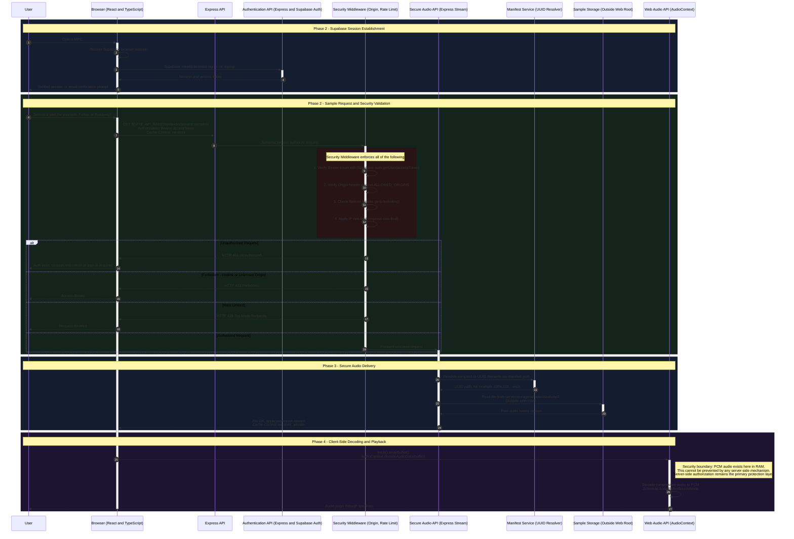

# MPC

A browser-based Music Production Center built with React, TypeScript, and the Web Audio API, backed by a Node.js/Express secure audio streaming service. MPC lets a user trigger, sequence, and record audio pads in real time entirely in the browser, while keeping the underlying sample assets protected behind an authenticated streaming API.

Author: [mohithkotian][def]

> **Note on audio assets.** This repository ships the application code only. The audio samples referenced throughout this document and the interface (including the Father and Runaway pad banks) are **not included, bundled, or distributed** in this repository in any format, including `.mp3`, `.wav`, or `.mp4`. Anyone deploying this project is responsible for supplying their own licensed audio samples in `server/storage/samples/`. No copyrighted audio is redistributed as part of this codebase.

---
## Dedication

This project is dedicated to Ye's catalog, and specifically built around two tracks that shaped its identity: **Father**, from *Bully*, and **Runaway**, from *My Beautiful Dark Twisted Fantasy*.

<p align="center">
  
  &nbsp;&nbsp;&nbsp;
  
</p>

These two tracks are the default pad bank loaded on launch, and the visual identity of the interface (typography, red accenting, distressed texture) is intentionally styled after both eras of work.

---

## System Architecture

The diagram below traces a complete request lifecycle: session establishment, sample selection, security validation, secure streaming, and client-side playback.


```mermaid
sequenceDiagram
    autonumber

    participant U  as User
    participant BR as Browser (React and TypeScript)
    participant API as Express API
    participant AA as Authentication API (Express and Supabase Auth)
    participant SM as Security Middleware (Origin, Rate Limit)
    participant SA as Secure Audio API (Express Stream)
    participant MS as Manifest Service (UUID Resolver)
    participant SS as Sample Storage (Outside Web Root)
    participant WA as Web Audio API (AudioContext)

    rect rgb(20, 30, 48)
        Note over U,WA: Phase 2 - Supabase Session Establishment
        U  ->>+ BR: Opens MPC
        BR ->>  BR: Restore Supabase browser session
        BR ->>+ AA: Supabase email/password sign-in or signup
        AA -->> BR: Session and access token
        deactivate AA
        BR -->> U: Verified session or email-verification prompt
        deactivate BR
    end

    rect rgb(20, 36, 28)
        Note over U,WA: Phase 2 - Sample Request and Security Validation
        U  ->>+ BR: Selects a pad (for example, Father or Runaway)
        BR ->>+ API: GET ${VITE_API_BASE}/api/audio/stream/:sampleId<br/>Authorization: Bearer accessToken<br/>Cache-Control: no-store
        API ->>+ SM: Authenticate and authorize request

        rect rgb(40, 20, 20)
            Note over SM: Security Middleware enforces all of the following
            SM ->>  SM: 1. Verify Bearer token with Supabase auth.getUser(accessToken)
            SM ->>  SM: 2. Verify Origin header against ALLOWED_ORIGINS
            SM ->>  SM: 3. Check Referer header (anti-hotlinking)
            SM ->>  SM: 4. Apply IP rate limit (express-rate-limit)
        end

        alt Unauthorized Request
            SM -->> BR: HTTP 401 Unauthorized
            BR -->> U: Auth error, session restoration or sign-in required
        else Forbidden - Hotlink or Unknown Origin
            SM -->> BR: HTTP 403 Forbidden
            BR -->> U: Access denied
        else Rate Limited
            SM -->> BR: HTTP 429 Too Many Requests
            BR -->> U: Request throttled
        else Authorized Request
            SM ->>+ SA: Forward validated request
            deactivate SM
        end
    end

    rect rgb(20, 28, 48)
        Note over U,WA: Phase 3 - Secure Audio Delivery
        SA ->>+ MS: Resolve sampleId to UUID filename via manifest.json
        MS -->> SA: UUID path, for example a3f9c1d2....mp3
        deactivate MS

        SA ->>+ SS: Read file from server/storage/samples/uuid.mp3<br/>(outside web root)
        SS -->> SA: Raw audio binary stream
        deactivate SS

        SA -->> BR: 200 OK, application/octet-stream<br/>Cache-Control: no-store, private
        deactivate SA
    end

    rect rgb(28, 20, 48)
        Note over U,WA: Phase 4 - Client-Side Decoding and Playback
        BR ->>+ WA: fetch().arrayBuffer()<br/>AudioContext.decodeAudioData(buffer)
        Note right of WA: Security boundary: PCM audio exists here in RAM.<br/>This cannot be prevented by any server-side mechanism.<br/>Server-side authorization remains the primary protection layer.
        WA ->>  WA: Decode compressed audio to PCM<br/>Schedule AudioBufferSourceNode
        WA -->> U: Audio plays through speakers
        deactivate WA
        deactivate BR
    end

```

---

## Infrastructure Topology

```
Render Cloud

  mpc-frontend                        mpc-backend
  Render Static Site                  Render Node Web Service
  Vite build (React/TS)                Express server
  dist/ static assets                  /api/auth/*
  VITE_API_BASE  --------------------> /api/audio/*
                                        /api/health

           HTTPS
              |
        User Browser
   React + Web Audio API
```

The frontend and backend are deployed as two independent native services on Render. The frontend build receives `VITE_API_BASE`, so browser API and audio requests go directly to the backend origin. The backend explicitly allows the deployed frontend origin through `ALLOWED_ORIGINS`; no wildcard CORS is used.

---

## Threat Model and Security Boundaries

### What this architecture prevents

| # | Threat | Mitigation |
|---|--------|-----------|
| 1 | DevTools or network tab extraction | Audio is never served from a static URL. No `.mp3`, `.wav`, or `.ogg` path is ever exposed. Every stream requires a valid signed bearer token. |
| 2 | Direct link sharing and hotlinking | `Origin` and `Referer` headers are validated against `ALLOWED_ORIGINS`. Requests from unknown domains receive HTTP 403. |
| 3 | Automated scraping | Per-IP rate limiting (`express-rate-limit`) restricts bulk harvesting. Each request requires an active authenticated session. |
| 4 | Static file exposure | Samples are stored outside the web root at `server/storage/samples/` using opaque UUID filenames. Physical paths and original filenames are never exposed to clients. |
| 5 | Token replay | Supabase manages browser sessions and refresh; the API accepts only verified short-lived Bearer access tokens. |
| 6 | Cache leakage | `Cache-Control: no-store, no-cache, must-revalidate, private` on all audio stream endpoints prevents browser and CDN caching. |

### Fundamental security boundary

When `AudioContext.decodeAudioData()` processes the received `ArrayBuffer`, the browser must decode compressed audio into raw uncompressed PCM data in system memory in order to produce speaker output. At this boundary, a determined user with low-level memory inspection tools, sound card loop-back recording, or a custom browser build can capture the PCM audio during playback. This is a fundamental property of the Web Audio API and cannot be blocked by any server-side mechanism.

Client-side obfuscation techniques such as DevTools blocking, right-click disabling, copy-paste prevention, or JavaScript obfuscation are deliberately not used. They provide no real protection at the audio level, degrade the user experience, and create a false sense of security. Protection lives entirely in server-side authorization, strict HTTP headers, anti-hotlinking enforcement, and rate limiting.

---

## Layered Security Control Matrix

| Layer | Mechanism | Implementation |
|-------|-----------|----------------|
| Storage at rest | UUID obfuscation | Samples stored outside the web root using opaque UUID filenames. Real paths are never exposed. |
| Access control | Supabase Bearer access tokens | Supabase access tokens are verified on every audio request using the request-scoped client. |
| Session persistence | Supabase-managed browser session | Browser session and refresh behavior are managed by the official Supabase client. |
| Transport security | HTTPS/TLS | All streams delivered over TLS by Render and Supabase. |
| Anti-hotlinking | Origin and Referer enforcement | Middleware rejects requests from domains not present in `ALLOWED_ORIGINS`. |
| Rate limiting | IP-based throttle | `express-rate-limit`: 100 auth requests per 15 minutes per IP. |
| Cache prevention | Strict Cache-Control | `no-store, no-cache, must-revalidate, private` on all `/api/audio/stream/*` endpoints. |
| API routing | Native cross-origin API | `VITE_API_BASE` points the browser to the backend; explicit `ALLOWED_ORIGINS` protects cross-origin access. |

---

## Tech Stack

| Layer | Technology |
|-------|-----------|
| Frontend framework | React 18, TypeScript |
| Build tool | Vite 6 |
| Audio engine | Web Audio API (`AudioContext`) |
| State management | Zustand |
| Backend runtime | Node.js 20, Express 4 |
| Authentication | Supabase Auth (`@supabase/supabase-js`) and Bearer access tokens |
| Security middleware | `helmet`, `cors`, `express-rate-limit` |
| Production frontend | Render Static Site serving Vite `dist/` |
| Production backend | Native Render Node Web Service running Express |
| Deployment | Render native services |

---

## Running Locally

### Prerequisites

- Node.js 20 or later
- Node.js 20 or later

### Development, both servers

```bash
npm run dev:all
# Vite frontend  -> http://localhost:5173
# Express backend -> http://localhost:3000
```

### Individual servers

```bash
npm run dev      # Vite frontend only
npm run server   # Express backend only
```

### Production build

```bash
# Frontend static artifact
npm ci
npm run build
# Publish dist/ with a static host and rewrite /* to /index.html.

# Backend validation and local start
npm run build:server
npm run server
```

---

## Environment Variables

| Variable | Purpose | Required |
|----------|---------|----------|
| `SUPABASE_URL` / `SUPABASE_ANON_KEY` | Supabase Auth project and publishable key | Yes |
| `VITE_SUPABASE_URL` / `VITE_SUPABASE_ANON_KEY` | Browser Supabase Auth configuration | Yes |
| `VITE_API_BASE` | Native backend origin used by browser API/audio requests | Yes for deployed frontend |
| `STORAGE_PROVIDER` / `SUPABASE_STORAGE_BUCKET` | Private sample storage provider and bucket | Yes for staging/production |
| `SERVER_ENCRYPTION_KEY` | 32-byte key for at-rest AES-256-GCM audio encryption | Yes, in production |
| `ALLOWED_ORIGINS` | Comma-separated list of origins permitted to stream audio | Yes |
| `NODE_ENV` | Set to `production` on deployment | Yes |
| `PORT` | Backend listen port | No, defaults to 3000 |

---


## 📝 License

<p>
  
  
  
</p>

| Component | Status |
|-----------|--------|
| **Source Code** | Copyright © 2026. Provided for personal and educational use. |
| **Album Artwork** | Property of the respective artists and labels. Used only as a non-commercial fan tribute. No ownership claimed. |
| **Audio Tracks** | Never included, bundled, or redistributed in this repository. Users must provide their own legally obtained audio files. |

---

<div align="center">

### 🎵 Built for learning, engineering, and music.

[](https://github.com/mohithkotian)

*This repository contains application source code only. It does not include, distribute, or expose copyrighted audio or other protected media. Users are responsible for supplying audio they are legally authorized to use.*

</div>

</div>
